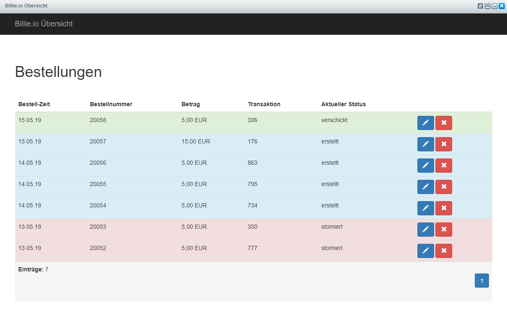

# Billie: Payment After Delivery

## Configuration
### Street & Housenumber
* Use `additional_address_line1` as housenumber! *(Has to be actived in shopware)*
* Set the values for the following snippets under `frontend/register/billing_fieldset` and `frontend/register/shipping_fieldset` accordingly
  * `RegisterLabelAdditionalAddressLine1` -> House Number
  * `RegisterBillingPlaceholderStreet` -> Street

## Displaying Attributes in Documents
To display the billie in the invoice document etc, they can be accessed in the document template files like so:

~~~html
IBAN {$Order._order.attributes.billie_iban}
~~~

Available Attributes are:
* `billie_iban`
* `billie_bic`
* `billie_state`